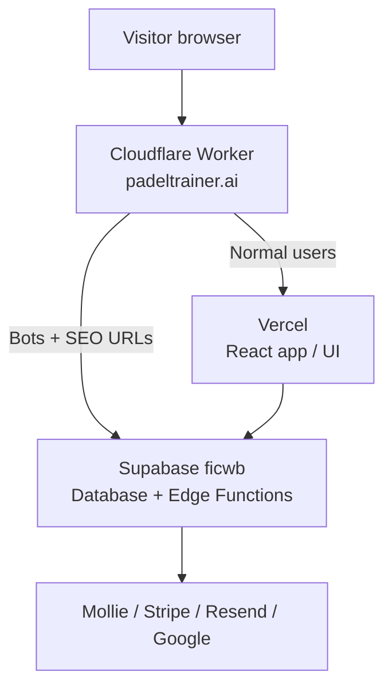

# PadelTrainer deployment guide

This guide is written for a **non-technical founder** operating production. Your developer (or agency) runs most terminal commands; you control **dashboards**, **go/no-go**, and **rollback switches**.

---

## How the live site is built (one picture)

Visitors open **https://padeltrainer.ai**. Traffic passes through several layers:



| Layer | What it does | Where you manage it |
|-------|----------------|---------------------|
| **Cloudflare Worker** | Routes `padeltrainer.ai`; sends people to the app; sends Google/bots to SEO functions | [Cloudflare Dashboard](https://dash.cloudflare.com) → Workers |
| **Vercel** | Hosts the website UI (login, dashboards, booking pages) | [Vercel Dashboard](https://vercel.com) → project `padeltrainer-independent` |
| **Supabase (ficwb)** | Database, login, payments logic, emails, invoices (server code) | [Supabase Dashboard](https://supabase.com/dashboard/project/ficwbdrzefmblkbkomzw) |
| **Sanity** | Blog / marketing content (separate from Supabase) | [Sanity](https://www.sanity.io/manage) |

**Production target (current stack)**

| Piece | ID / URL |
|-------|----------|
| Public site | https://padeltrainer.ai |
| Vercel app | https://padeltrainer-independent.vercel.app |
| Supabase project | `ficwbdrzefmblkbkomzw` → https://ficwbdrzefmblkbkomzw.supabase.co |
| GitHub repo | `joranhofman87/padeltrainer-independent` (app code under `padeltrainer/` folder) |
| Legacy (rollback only) | Lovable + Supabase `ppkbhdiiqdusdeatgdft` |

---

## Before any deployment

1. **Say what you are changing** (UI only? payments? database?) and pick a **quiet window** if it touches money or login.
2. **Never paste secrets** in Slack, email, or tickets. Set them only in Supabase / Vercel / Cloudflare dashboards.
3. Keep a **rollback note**: what was changed, when, and who did it.
4. For database changes: insist on a **backup** or dry-run first (developer task).

**Who does what**

| Task | Founder | Developer |
|------|---------|-----------|
| Approve release | ✓ | |
| Click deploy in Vercel / Cloudflare | ✓ (with instructions) | ✓ |
| Run `git`, `npm`, Supabase CLI | | ✓ |
| Edit SQL migrations | | ✓ |
| Update Mollie/Stripe/Google webhooks | ✓ (with dev URLs) | ✓ |

---

## 1. Frontend deployment flow

The “frontend” is everything users see in the browser. It is built from the React app and deployed to **Vercel**. Users reach it via **Cloudflare** (`ORIGIN_URL`).

### Normal flow (recommended)

1. Developer merges code to the **main** branch on GitHub (`padeltrainer-independent`).
2. **Vercel** automatically builds and deploys (usually 2–5 minutes).
3. You verify on **Vercel → Deployments** that the latest deployment is **Ready**.
4. **Cloudflare** must point `ORIGIN_URL` at your Vercel URL (see §5). If that is already correct, the new UI goes live on the next visit (you may need cache purge—see §5).
5. Smoke test in **incognito**: https://padeltrainer.ai/app/auth (login page loads, no blank screen).

### What must be correct on Vercel (Production environment)

These are **not secrets** in the sense of payment keys—they are public keys wired into the app:

| Variable | Should point to |
|----------|-----------------|
| `VITE_SUPABASE_URL` | `https://ficwbdrzefmblkbkomzw.supabase.co` |
| `VITE_SUPABASE_PUBLISHABLE_KEY` | ficwb **anon** key (from Supabase → Settings → API) |
| `VITE_SUPABASE_PROJECT_ID` | `ficwbdrzefmblkbkomzw` |

If these still mention `ppkbhd`, the site will talk to the **old** database.

### Manual frontend deploy (if auto-deploy is off)

Developer runs from the `padeltrainer` folder:

```bash
npm ci
npm run build
npx vercel deploy --prod
```

You confirm the new deployment in the Vercel dashboard and that Cloudflare `ORIGIN_URL` matches.

### Frontend deploy — “done” checklist

- [ ] Vercel production deployment status: **Ready**
- [ ] Opening https://padeltrainer.ai shows the app (not an old Lovable page)
- [ ] Login page loads; no obvious errors in the browser console (developer can check)

---

## 2. Edge Function deployment flow

**Edge Functions** are small server programs on Supabase (payments, emails, invoices, sitemaps). The website calls them in the background. They do **not** deploy when you deploy Vercel—you deploy them **separately** to the ficwb project.

### When you need an edge deploy

- After changing anything under `supabase/functions/`
- When a feature fails in the browser **Network** tab with `404` on `.../functions/v1/<name>`
- After copying secrets to a new Supabase project

### Flow (developer)

1. **Secrets first** (one-time or when adding integrations): Supabase Dashboard → Project **ficwb** → Edge Functions → **Secrets**. See `docs/FICWB_SECRETS_AUDIT.md` for the list.
2. Deploy one or all functions:

```bash
cd padeltrainer
npx supabase login
npx supabase functions deploy <function-name> --project-ref ficwbdrzefmblkbkomzw
```

Deploy everything in the repo (simplest, longer):

```bash
npx supabase functions deploy --project-ref ficwbdrzefmblkbkomzw
```

3. Confirm in Dashboard → Edge Functions that status is **ACTIVE**.
4. Smoke test the feature (e.g. login → subscription check, test booking, test email).

### External webhooks (founder + developer)

After edge deploys, third-party dashboards must use **ficwb** URLs, not the old Lovable project:

| Service | Webhook / callback URL |
|---------|-------------------------|
| Mollie | `https://ficwbdrzefmblkbkomzw.supabase.co/functions/v1/mollie-webhook` |
| Stripe (if used) | `https://ficwbdrzefmblkbkomzw.supabase.co/functions/v1/stripe-subscription-webhook` |
| Google OAuth | `https://ficwbdrzefmblkbkomzw.supabase.co/auth/v1/callback` |

### Edge deploy — “done” checklist

- [ ] Function shows **ACTIVE** in Supabase
- [ ] Related secret exists (Resend, Mollie, etc.)—no “not configured” errors
- [ ] One real user flow tested (login, payment, or email)

**Note:** Some background jobs in the database still call **old** URLs until cron jobs are updated—ask your developer before relying on auto enrichment/logo fetch.

---

## 3. Database migration flow

The **database** holds users, bookings, invoices, and settings. Schema changes live in `supabase/migrations/` as SQL files. Data imports for the big migration used scripts in `scripts/migration/` (usually **one-time**).

### Two different activities

| Activity | What it means | Risk |
|----------|---------------|------|
| **Schema migration** | Change table structure (new columns, policies) | High—can break the app if wrong |
| **Data import / fix** | Copy or repair rows (migration project) | High—can duplicate or wipe data |

### Schema migration flow (developer)

1. **Backup**: Supabase Dashboard → Database → Backups (or confirm point-in-time recovery on your plan).
2. Review new files in `supabase/migrations/` on a **branch**; test on a **staging** Supabase project if you have one.
3. Apply to ficwb:

```bash
cd padeltrainer
npx supabase link --project-ref ficwbdrzefmblkbkomzw
npx supabase db push
```

4. Founder verifies: login, open trainer dashboard, spot-check bookings/invoices.

### One-time data migration scripts (already done for go-live)

These are **not** part of day-to-day deploys. Only re-run if your developer explicitly instructs:

| Script area | Purpose |
|-------------|---------|
| `scripts/migration/auth_import_*.py` | Create auth users from profiles |
| `scripts/migration/import_public_*.py` | Import CSV exports into Postgres |
| `scripts/migration/storage_*.py` | Copy files and fix URLs |

They require `DATABASE_URL` and service keys in the environment—**never** commit those to git.

### Database migration — “done” checklist

- [ ] Backup confirmed before change
- [ ] Migration applied without errors
- [ ] Login works for trainer and player
- [ ] Sample booking and invoice still visible
- [ ] No spike in errors in Supabase → Logs

**Founder rule:** Do not approve database changes during peak booking hours unless it is an emergency fix.

---

## 4. Cloudflare Worker deployment flow

The Worker is the **traffic director** for `padeltrainer.ai`. It is **not** deployed from GitHub automatically. The source code is kept in the repo as a reference: `docs/cloudflare-worker.js`.

### When to update the Worker

- Changing how bots/SEO see the site
- Switching where normal users go (Lovable ↔ Vercel)
- Pointing sitemaps / LLM files to a new Supabase project

### Flow (founder-friendly, in Cloudflare Dashboard)

1. Log in to [Cloudflare](https://dash.cloudflare.com) → **Workers & Pages**.
2. Open the Worker attached to **padeltrainer.ai** (route: `padeltrainer.ai/*`).
3. **Edit code**: paste updated script from `docs/cloudflare-worker.js` (developer prepares the file).
4. **Settings → Variables → Production** — verify:

| Variable | Production value |
|----------|------------------|
| `ORIGIN_URL` | `https://padeltrainer-independent.vercel.app` |
| `RENDER_FUNCTION_URL` | `https://ficwbdrzefmblkbkomzw.supabase.co/functions/v1/render-page` |
| `SITEMAP_FUNCTION_URL` | `https://ficwbdrzefmblkbkomzw.supabase.co/functions/v1/sitemap` |
| `LLMS_FUNCTION_URL` | `https://ficwbdrzefmblkbkomzw.supabase.co/functions/v1/llms-full-txt` |
| `SUPABASE_ANON_KEY` | Same publishable key as Vercel `VITE_SUPABASE_PUBLISHABLE_KEY` |

5. **Save and deploy** the Worker.
6. **Caching → Configuration → Purge Everything** (or purge `padeltrainer.ai`) so visitors do not see an old HTML/JS bundle.
7. Quick checks (developer or you with curl):

```bash
curl -sI https://padeltrainer.ai/sitemap.xml
curl -sI https://padeltrainer.ai/llms-full.txt
```

Expect HTTP **200** (not 404).

### Worker deploy — “done” checklist

- [ ] `ORIGIN_URL` is Vercel (not `padeltrainer.lovable.app`) for production
- [ ] All `*_FUNCTION_URL` values use **ficwb**, not `ppkbhd`
- [ ] Homepage loads the app; sitemap and `llms-full.txt` return 200
- [ ] Cache purged after change

---

## 5. Vercel deployment flow

Vercel hosts the static **built** app (HTML + JavaScript).

### Project settings (set once)

| Setting | Value |
|---------|--------|
| Repository | `joranhofman87/padeltrainer-independent` |
| Root directory | `padeltrainer` (if the repo root is one level above the app) |
| Framework | Vite |
| Build command | `npm run build` |
| Output directory | `dist` |
| Production branch | `main` (or your agreed branch) |

`vercel.json` in the repo enables single-page-app routing (all paths serve `index.html`).

### Production deploy flow

1. Merge to production branch → Vercel builds automatically.
2. Dashboard → **Deployments** → latest → **Visit** (preview URL).
3. If preview looks good, production alias updates (or promote to Production).
4. Ensure Cloudflare `ORIGIN_URL` targets this project’s production URL.
5. Purge Cloudflare cache if users still see an old version.

### Environment variables

Set under **Settings → Environment Variables → Production**:

- `VITE_SUPABASE_URL`
- `VITE_SUPABASE_PUBLISHABLE_KEY`
- `VITE_SUPABASE_PROJECT_ID`
- Any Sanity keys your developer documents

Changing env vars requires a **redeploy** (Vercel usually triggers one automatically).

### Vercel — “done” checklist

- [ ] Latest deployment: **Ready**
- [ ] Production env vars use **ficwb**
- [ ] Preview URL works before you announce go-live
- [ ] Cloudflare cache purged after production cutover

---

## 6. Rollback procedure

Rollback depends on **what broke**. Fastest fix is usually Cloudflare (where traffic enters).

### Level A — Instant: send traffic back to old Lovable stack

Use only if the new Vercel + ficwb stack is broken and you need the old site live **now**.

1. Cloudflare Worker → Production variables → change:
   - `ORIGIN_URL` → `https://padeltrainer.lovable.app` (legacy)
   - `RENDER_FUNCTION_URL`, `SITEMAP_FUNCTION_URL`, `LLMS_FUNCTION_URL` → old `ppkbhd` function URLs
   - `SUPABASE_ANON_KEY` → old ppkbhd anon key
2. **Purge cache** for `padeltrainer.ai`.
3. Verify homepage and login on the old stack.

**Trade-off:** Users see the old app; new ficwb data may not match what they see. Use for emergencies; plan a forward fix.

### Level B — UI broken only: keep ficwb, revert Vercel

1. Vercel → **Deployments** → find last **good** deployment → **⋯ → Promote to Production**.
2. Purge Cloudflare cache.
3. Test login and one booking.

### Level C — One feature broken: revert one Edge Function

Developer redeploys a known-good version from git history:

```bash
git checkout <good-commit> -- supabase/functions/<name>/
npx supabase functions deploy <name> --project-ref ficwbdrzefmblkbkomzw
```

### Level D — Database bad migration

**Stop.** Do not run more migrations. Contact developer immediately. Options: restore from Supabase backup / PITR, or run a forward-fix migration. **Founders should not run SQL by hand.**

### Rollback decision table

| Symptom | First action |
|---------|----------------|
| Whole site blank / wrong app | Level A or B (check `ORIGIN_URL` first) |
| Login broken for everyone | Check Supabase Auth URLs; edge `signup-user` / `send-auth-email` |
| Payments broken | Mollie webhook URL + ficwb secrets; do not rollback DB lightly |
| Only blog/SEO wrong | Worker SEO URLs + deploy `sitemap` / `llms-full-txt` |
| One button errors | Level C for that function |

After any rollback, write down: time, what you changed, and whether ficwb data and old stack are now out of sync.

---

## 7. Production checklist

Use this before announcing “we’re live” or after any major deploy.

### Traffic and hosting

- [ ] https://padeltrainer.ai loads (no Lovable cookie / old bundle)
- [ ] Cloudflare `ORIGIN_URL` = Vercel production URL
- [ ] Cloudflare function URLs + anon key = **ficwb**
- [ ] Vercel `VITE_SUPABASE_*` = **ficwb**
- [ ] `curl -sI https://padeltrainer.ai/sitemap.xml` → 200
- [ ] `curl -sI https://padeltrainer.ai/llms-full.txt` → 200

### Auth and accounts

- [ ] Email/password login (trainer + player)
- [ ] Google login
- [ ] Password reset email (if enabled)
- [ ] New signup (test account)
- [ ] Session cookie name includes `ficwb` (developer checks in browser)

### Core product

- [ ] Trainer dashboard loads data
- [ ] Academy dashboard loads data
- [ ] Create / view availability
- [ ] Complete a test booking
- [ ] Mollie test payment (or invoice payment) completes
- [ ] Invoice PDF generates for a **new** invoice
- [ ] One transactional email received (Resend dashboard)

### Integrations

- [ ] Mollie webhook points to ficwb `mollie-webhook`
- [ ] Supabase Edge secrets: Resend + Mollie at minimum (`docs/FICWB_SECRETS_AUDIT.md`)
- [ ] Google OAuth redirect URI includes ficwb callback URL
- [ ] Stripe (if still used): checkout + webhook on ficwb

### SEO and content

- [ ] Blog / marketing pages load (Sanity)
- [ ] Public trainer booking page works
- [ ] Remove temporary “MIGRATION TEST” badge when satisfied (`MarketingLayout.tsx`)

### Safety and hygiene

- [ ] No production secrets in git or chat logs
- [ ] Database backup policy confirmed on Supabase plan
- [ ] Plan to rotate ficwb database password after migration window
- [ ] Known deferred items documented (`MIGRATION_STABILIZATION.md`): old invoice PDFs, cron URL updates, etc.

### After deploy — monitor (first 24 hours)

- [ ] Supabase → Logs / Edge Functions: no spike in 5xx errors
- [ ] Resend: delivery not failing
- [ ] Mollie: payments moving to `paid`
- [ ] Support inbox: no cluster of login/payment complaints

---

## Related documents

| Document | Use for |
|----------|---------|
| `MIGRATION_STABILIZATION.md` | Detailed smoke tests and known issues |
| `docs/FICWB_SECRETS_AUDIT.md` | Which secrets must exist on ficwb |
| `docs/EDGE_FUNCTIONS_FICWB_AUDIT.md` | Function deploy priority history |
| `docs/cloudflare-worker.js` | Worker source to paste in Cloudflare |

---

## Quick contacts / dashboards

| System | Link |
|--------|------|
| Production site | https://padeltrainer.ai |
| Vercel | https://vercel.com (project: `padeltrainer-independent`) |
| Supabase ficwb | https://supabase.com/dashboard/project/ficwbdrzefmblkbkomzw |
| Cloudflare | https://dash.cloudflare.com |
| Mollie | https://my.mollie.com |
| Resend | https://resend.com/emails |

*Last updated for stack: Cloudflare → Vercel → Supabase ficwb (`ficwbdrzefmblkbkomzw`).*
