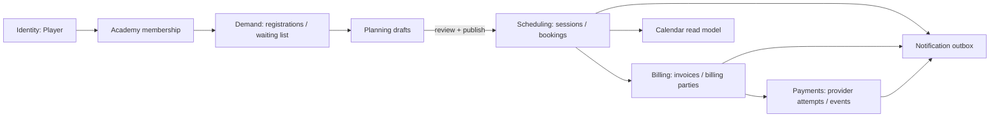
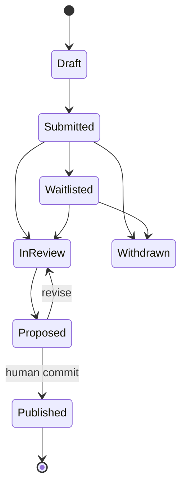
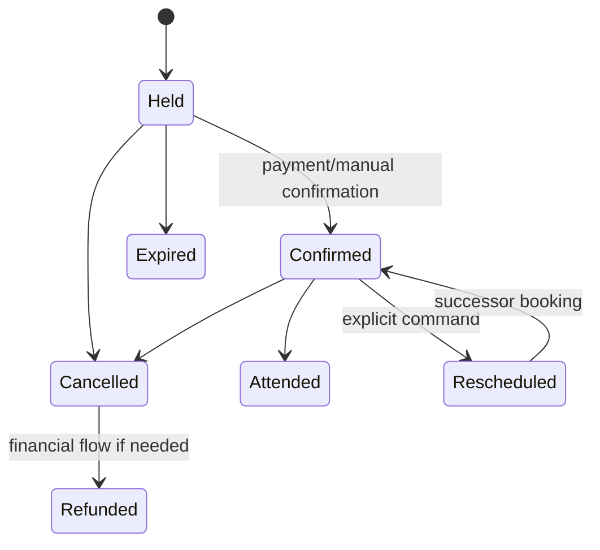

# Foundation architecture blueprint

**Status:** OD-02–OD-06 accepted 2026-08-07, OD-09/OD-10 accepted 2026-08-08 (`FOUNDATION_DECISIONS.md`; the broader product-direction table there is recorded direction pending per-unit reconfirmation — see its provenance note); OD-07/OD-08 open. Implementation only via the bounded units in `FOUNDATION_EXECUTION_PLAN.md` — currently U1a alone is authorized  
**Evidence baseline:** `ea54f08b3a204a4ed29c3d37976d51ed2d841ad6`  
**Target:** secure, maintainable operation at 100,000+ Players and high-volume academies

This is a target contract, not permission to implement it. Accepted product decisions are separated
from proposals in `FOUNDATION_DECISIONS.md`.

## 1. Bounded contexts and ownership

| Context | Owns | Does not own |
|---|---|---|
| Identity | `Player` UUID, login attachment, player-owned profile/contact | academy notes, scheduling, invoices |
| Academy relationship | membership, academy-private notes/status/tags/trainer assignment/overrides | global identity or credentials |
| Workforce | trainer identity plus academy-specific trainer membership/capabilities | Player data outside granted academy scope |
| Demand | registration forms, intake submissions, preferences, waiting-list claims | committed schedule |
| Planning | drafts, proposals, constraint checks, impact previews, publication revisions | agenda presentation |
| Scheduling | sessions, cycles, slots/resources, bookings, capacity and change commands | demand-form lifecycle |
| Billing | billing profiles/parties, price snapshots, invoices, credits | payment-provider truth |
| Payments | provider attempts/events, reconciliation, refunds, normalized outcomes | invoice composition |
| Calendar | bounded agenda/read models | mutation orchestration |
| Notifications | event-driven delivery and operational controls | source-domain state transitions |



## 2. Canonical Player and academy relationships

`Player` is the domain name; `persons` may remain the physical/internal table name to avoid a risky
rename. Its UUID is canonical and never changes when credentials are attached. `user_id` is nullable
and unique: authentication is an optional capability of a Player, not a second identity.

Proposed core relations:

```text
persons(id, user_id?, player-owned identity/profile fields)   -- EXISTS today; a lifecycle-status column would be NEW
academy_player_memberships(id, academy_profile_id, person_id, status, private notes,
                            trainer assignment, timestamps)   -- NEW (U1a adds the EMPTY skeleton; a focused
                                                              --      relationship ROOT per OD-03 — no settings
                                                              --      container; overrides/repeating data go to
                                                              --      membership-linked child tables later)
academy_player_membership_tags(membership_id, tag_id)         -- NEW; today `academy_player_tags` holds tag DEFINITIONS
                                                              --      and assignments live in academy_player_metadata.tag_ids
player_billing_profiles(id, person_id, kind personal|company, details)  -- NEW
```

- Exactly one canonical relationship row per `(academy_profile_id, person_id)` across every lifecycle
  state — status lives on the row; no duplicate historical rows.
- Academy-private fields are readable only by authorized academy actors.
- Player-owned fields are visible to the Player and disclosed to an academy only through a valid relationship/flow.
- Academy fields are hidden from the Player unless an explicit sharing contract says otherwise (proposed `shared_at/shared_by` audit columns; today the only sharing mechanism is `session_player_notes.visibility = 'shared'`).
- Duplicate resolution remains the reviewed merge command. Per OD-09 (2026-08-08) D-04 supersedes the shipped unique-email B2 auto-merge: its retirement is a later authorized slice; historical auto-merges stay intact and reviewable, never auto-unmerged; email/phone signals never carry merge authority going forward.
- Account claim attaches `auth.users.id` to the existing Player in an idempotent, audited transaction.
- `profiles`, `guest_players`, and old foreign keys remain compatibility internals until every read, write,
  historical row, policy, function, export, and reconciliation proves migration.

## 3. Academies, trainers, locations, and permissions

Manager authority is granted per academy relationship (`academy_managers` rows; one account may hold
manager roles at several academies). Clubs/venues are independent tenant-owned entities, not academy
children. Academies and venues would connect through a proposed many-to-many `academy_venue_relationships`
association (today: `academy_locations`, which this would extend or replace): several academies may train
at one venue and an academy may use several venues. The academy may manage only its own association
metadata; only the club/venue owner may edit venue identity, address, facilities, media, or other
venue-owned details. The academy may immediately show its own "we train here" declaration on its own
page, but it appears on the venue page only after the venue/club confirms the association (today
`academy_locations.show_on_club_page` is academy-controlled and defaults true, so the confirmation gate
is a migration target, not current behavior). Neither surface exposes the other tenant's private data or
grants cross-tenant edit authority.

Trainer authority is relationship-specific. Proposed capabilities:

| Capability | Academy manager | Trainer default | Player |
|---|---:|---:|---:|
| View assigned agenda | yes | yes | own only |
| Record attendance/session notes | yes | yes for assigned sessions | no |
| View assigned Player contact needed for delivery | yes | yes, minimized | own |
| Create/edit own availability | configurable | yes | no |
| Manage registrations/planning | yes | **off** | submit own demand |
| Create/reschedule/cancel bookings | yes | configurable | own within rules |
| View academy-private notes/tags | yes | configurable subset | no unless shared |
| View/create invoices or refunds | yes with high-risk grant | off | own invoices/payments |
| Grant permissions | yes | no | no |
| Change trainer global identity/credentials | no | self-service | n/a |

Enforcement lives in database predicates/RPCs and server functions. UI wrappers consume an effective
capability set but never become the authority. Grant/revoke transitions are append-only audited.

## 4. Demand, Planning, and Calendar

Registration forms own submissions and preferences. Planning consumes demand; Calendar renders committed
schedule data. They do not write through each other.



A planning revision contains immutable inputs, proposal assignments, validation results, author, and a
revision/hash. Suggestions are drafts. `preview_publication(revision)` returns affected Players, sessions,
bookings, prices, invoices/payments, and notifications. `publish_planning_revision` locks the revision,
rejects stale previews, writes sessions/bookings atomically, records the outcome, and emits after-commit
domain events. Replaying the idempotency key returns the original outcome.

Calendar queries use academy/trainer scope, bounded date windows, and cursor/keyset pagination. Calendar
mutation affordances open Planning or a scheduling change command; they do not orchestrate table writes.

## 5. Sessions, cycles, bookings, and change scope

- `Session` is the independently cancellable/reschedulable occurrence.
- `Cycle` groups sessions and stores recurrence/source intent, not duplicated booking truth.
- `Booking` joins one Player to one Session and owns its lifecycle, price snapshot, and capacity effect.
- Resource/court capacity is enforced in Postgres under row/advisory locks.

Booking state proposal:



Transitions are commands with actor, reason, idempotency key, previous version, and audit event. A
reschedule links predecessor and successor rather than rewriting history invisibly.

Every session/cycle change requires:

1. explicit scope: this session, selected sessions, future sessions, or entire cycle;
2. server-generated preview with counts and monetary/notification effects;
3. user confirmation of that preview revision;
4. a single transaction for domain and financial database effects;
5. durable after-commit work for provider calls/notifications.

## 6. Billing, invoices, and payments

A Player has at most one personal billing profile and at most one optional company billing profile
(OD-06); `UNIQUE (person_id, kind)` prevents unnecessary duplicates. Personal is expected to be the usual choice, with
company details selected explicitly when relevant (a proposed UX default — not part of the accepted
decision). An issued invoice stores an immutable billing-party
snapshot so later profile edits do not rewrite history.

Proposed invoice states: `draft → issued → partially_paid|paid|overdue → credited|void`, with only
explicitly allowed transitions (current vocabulary is `draft|sent|paid|overdue|cancelled` — `issued`
renames today's `sent`, `credited|void` split today's `cancelled`, `partially_paid` is new). “Cancel”
and “refund” are distinct. Paid evidence cannot be deleted or reset.

Payment attempts/events become separate from invoices and bookings. Proposed relations (none of these
exist today — the current payment-side tables are `payment_audit_log`, `stripe_webhook_events`,
`subscription_payments`, `invoice_status_history`, `mollie_oauth_states`, and the `*_stripe_accounts`
tables):

```text
payment_attempt(id, invoice_id?, provider, amount, currency, idempotency_key, state)
payment_provider_event(id, provider, provider_event_id, received_at, payload_hash, normalized_outcome)
payment_allocation(payment_attempt_id, invoice_id/booking_id, amount)
financial_transition(id, entity, from_state, to_state, actor, reason, evidence, occurred_at)
```

Provider adapters implement create, retrieve, cancel, refund, and verify-webhook. Mollie is the first
adapter; manual invoice/payment is an explicit method; future providers implement the same normalized
contract. Provider payloads never directly define application authorization.

Reconciliation is read-first and continuously visible. Recovery actions preview one entity, require a
reason and high-risk capability, are idempotent/audited, and never rely on routine raw SQL.

## 7. Frontend and data-access architecture

- Thin role pages compose neutral domain components and hooks.
- Shared UI remains in `components/ui`; reusable domain UI lives in neutral folders.
- Domain query modules expose cursor/page metadata and bounded filters.
- Domain command clients call RPC/server commands and return typed outcomes.
- Tenant and capability authorization stays outside presentation components.
- Split large components along workflows (inputs, preview, publish, recovery), not into generic mega-components.
- Accessibility contract: keyboard complete, labelled controls, focus restoration, error summary, non-color status,
  and screen-reader announcements for asynchronous results.

Suggested module shape:

```text
src/domains/<context>/queries/*
src/domains/<context>/commands/*
src/domains/<context>/types.ts
src/components/<context>/*
src/pages/<role>/*        # composition only
```

## 8. Scale, security, observability, and recovery

- Keyset pagination for growing collections; offset pagination only for bounded/admin use with a measured ceiling.
- Agenda/calendar queries require a bounded date window; exports use asynchronous jobs and object storage.
- Aggregates execute in Postgres and return summary rows, never entire tables.
- Every list query has a deterministic index-compatible order and maximum page size.
- Multi-row scheduling/financial commands are atomic and idempotent.
- RLS and constraints are durable backstops; SECURITY DEFINER functions use fixed `search_path`, minimal grants,
  internal scope derivation, and two-tenant adversarial tests.
- Structured command/audit IDs join application logs, provider events, notifications, and database transitions.
- Kill switches target bounded workflows; recovery favors roll-forward and replay-safe commands.
- Define SLOs plus RPO/RTO. Rehearse restore on a disposable environment before claiming DR readiness.
- Synthetic suites seed 100k Players and production-shaped relationships; concurrency tests use real Postgres.

## 9. Migration safety contract

Every identity/relationship/billing migration programme follows this sequence across its units — an
individual expand-only migration (such as U1a) satisfies steps 1–2 plus rollback, while full
backfill/dual-write/switch proof belongs to the data-moving units:

1. inventory counts, duplicates, orphans, cross-tenant anomalies, and current references;
2. additive tables/columns/indexes with no read switch;
3. deterministic mapping table and resumable checkpointed backfill;
4. reconciliation and production-shaped rehearsal;
5. dual-write (or authoritative new write plus compatibility projection) with drift monitoring;
6. switch bounded readers, then writers;
7. prove zero legacy-only rows/references over an owner-agreed observation window;
8. contract in a later owner-gated release with rollback/roll-forward instructions.

No backfill generates notifications or emails. No legacy table/key/path is deleted merely because the
new model exists. Issued financial records retain immutable snapshots and mapping evidence.

## 10. Definition of architecture-ready

The blueprint is implemented unit-by-unit: a unit may start when the decisions that gate that unit are
owner-approved (OD-02/OD-03 suffice for U1a; open OD-07/OD-08 gate U3/U7, and decided OD-09/OD-10 impose
later-slice prerequisites), the four documents are
consistent, the independent review has no actionable finding for that checkpoint, and the owner approves
the bounded release unit. Unit approval is not approval to merge, deploy, migrate production, or contract
legacy data.
