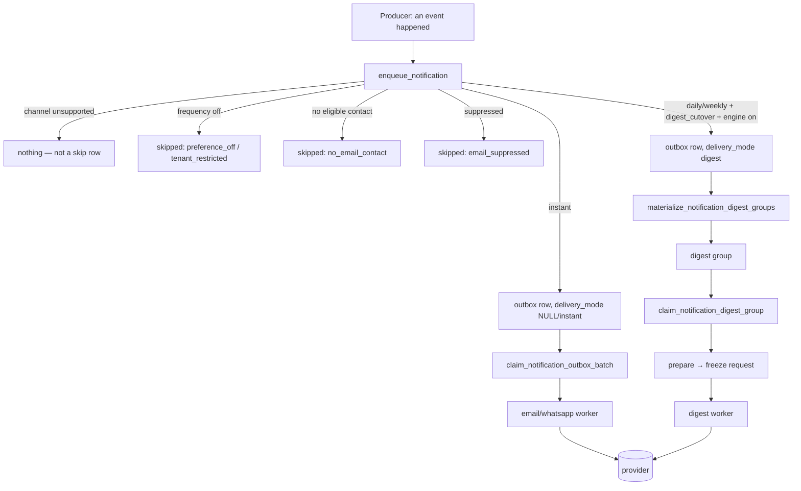

# Notification foundation — the as-built reference

Status: **canonical** (N6) | last updated 2026-08-05 | pipeline v2
Audience / AI-read: yes. **Pinned by `src/test/notificationFoundationDocs.test.ts`** — the claims
below that could rot silently are asserted against the code, so a change that contradicts this
file fails a test until the file is updated in the same commit.

This is what the pipeline *is* and how it *behaves*. Running it — kill switches, canary, rollback,
recovery, monitoring, the owner-gated activation sequence — is
[`NOTIFICATION_OPERATIONS.md`](NOTIFICATION_OPERATIONS.md).
[`NOTIFICATION_ARCHITECTURE.md`](NOTIFICATION_ARCHITECTURE.md) is the historical design record (the
2026-07 audit, the reconciliation decisions and the PR sequence); where the two disagree, this file
is the one that matches the code.

---

## 1. Ownership boundaries — who is allowed to decide what

| Layer | Owns | Must NOT |
|---|---|---|
| **Producers** (edge functions, RPCs, triggers) | *That an event happened*, its subject, its recipient and its **tenant attribution** | Decide channels, cadence, consent or content |
| **Resolver** (`enqueue_notification`) | Preferences, academy caps, consent scope, contact resolution, suppression, digest routing, idempotency identity | Send anything, or read provider state |
| **State machine** (SQL) | Every transition, lease, retry, breaker move, group identity, reservation | Render, call a provider, or invent a decision the resolver did not record |
| **Workers** (edge) | Calling the provider exactly once per attempt and reporting the outcome | Re-decide eligibility, re-render a frozen request, or continue past a refused claim |
| **Admin surface** | Visibility, plus audited idempotent recovery — stopping controls (kill, cancel, dispose) and two that RESTORE send authority (circuit reset, orphan requeue) | Offer any generic resend/retry primitive, or open a delivery path |
| **Owner** | Merge, deploy, activation, real sends, provider configuration | — |

The one-line version: **producers say what happened, the resolver decides, SQL owns state,
workers only carry.**

## 2. The event catalogue

`public.notification_event_types` is the catalogue. Per event: `supports_email` /
`supports_whatsapp` / `supports_push`, the per-channel default frequency, `required_delivery`,
`visibility_scope`, `whatsapp_optin_via_booking`, and the digest flags (`supports_digest`,
`digest_cutover`, `digest_engine_enabled`, `template_version`).

Seeded events (20260910100000, plus `open_slots_player` in 20261008100000): booking
confirmed/cancelled/request (player + staff), `session_reminder_player`, payment receipt/received,
invoice created/paid/failed/reminder, rebook invite/paid, `review_received_trainer`,
`password_reset`, `account_email_changed`, `marketing_updates`, `open_slots_player`.

**A channel the catalogue does not support is skipped before anything else is computed** — no
preference read, no cap, no contact lookup. The admin preview reports that same order, so a
support flag is never confused with a preference.

## 3. Instant vs digest

Routing is decided **once, at enqueue**, and frozen on the row (`delivery_mode`, the digest
boundary, the destination fingerprint, the template version). The instant claim excludes
`delivery_mode = 'digest'`; the materializer takes only those rows. A digest group is rendered
**once** into a frozen request and sent under a frozen idempotency key — the worker never
re-renders.

## 4. Precedence — the order that decides a send

1. **Catalogue support.** Unsupported channel → nothing.
2. **Explicit preference** (`notification_preferences_v2`, per user × event × channel) wins over
   the opt-in, the catalogue default and any academy cap — but **not** over required delivery
   (step 6), which is the one thing above it for email.
3. **WhatsApp booking opt-in** — only when no explicit preference exists, only for events flagged
   `whatsapp_optin_via_booking`, and only from an in-scope opted-in contact.
4. **Catalogue default** for the channel.
5. **Academy cap** (`academy_notification_restrictions`): **most restrictive wins, never a floor.**
   It applies only to *optional* events, only to *academy-attributed* sends, and only when it is
   stricter than what the player already chose. A cap-caused `off` writes a terminal
   `tenant_restricted` row so the audit says *who* silenced it. See
   [`NOTIFICATION_ATTRIBUTION_MATRIX.md`](NOTIFICATION_ATTRIBUTION_MATRIX.md) for which producers
   supply an academy at all.
6. **Required delivery** runs **last** for email: a `required_delivery` event is forced to
   `instant`, so no stale cap and no preference can weaken a service notification.
7. **Contact + consent scope**, then **suppression**.

## 5. Identity, idempotency and provider acceptance

* **Outbox identity** — `unique (channel, idempotency_key, tenant_scope_key)`. The key is
  `event:subject:recipient`, the recipient leg being person → user → guest. Tenant scope is part
  of the identity, so the same event legitimately reaching two tenants is two rows, and a retry of
  the same send is one.
* **Provider identity** — a digest group carries a frozen `provider_idempotency_key`; the Resend
  call passes it, so a retried HTTP request within the provider's window cannot duplicate.
* **Ambiguity is a state, not an error.** A timeout or unreadable response makes the group
  `uncertain` with a deadline. It is never re-sent on a guess: past the deadline it finalizes
  `delivery_unknown`. That is why this system has **no generic retry/resend control** anywhere.
* **Correlation is checked.** If the provider accepts a message id the group is not bound to, the
  run is unhealthy and the channel is held for a human.

## 6. The no-backlog activation boundary (N5)

A **delivery path** is `channel:mode` — `email:instant`, `email:digest`, `whatsapp:instant`. Each
has one durable row in `notification_activation_boundaries`:

| State | Meaning | Send authorities |
|---|---|---|
| `inert` | never opened | claim **nothing**, materialize **nothing**, dispatch **nothing** |
| `active since boundary_at` | opened at that instant | only rows **created** at or after it |

The transition is one-way and `boundary_at` is immutable (owner-effective guard): a boundary that
can move is a window that can be widened to re-admit the history it excluded. Enforced at
`claim_notification_outbox_batch` (fresh **and** orphan-reclaim arms),
`materialize_notification_digest_groups` (candidate **and** member scans) and
`claim_notification_digest_group` (the scan **and** the half-open breaker probe — the one claim
that does not come from the scan).

`email:instant` is seeded **unbounded** (`-infinity`): it was already sending when the contract was
written, and no computed instant can be proven not to exclude mail that was queued concurrently.
Closing that path is what the **kill switch** is for. The other two are opened by the operator —
`enable_engine.sql` opens `email:digest` in the *same transaction* that enables routing.

Rows the boundary permanently excludes are terminally skipped through
`admin_dispose_pre_boundary_backlog` (audited, bounded, idempotent, `pending → skipped` only).

## 7. State machines

**Outbox row** — `pending → processing → sent | delivered | failed | skipped | cancelled |
delivery_unknown`. `skipped` always carries a reason (`preference_off`, `tenant_restricted`,
`no_email_contact`, `email_suppressed`, `no_deliverable_channel`, `pre_activation_boundary`).

**Digest group** — `pending → leased → prepared → request_ready → sending → sent`, with the
terminal set `failed_terminal`, `oversize_failed`, `delivery_unknown`, `retry_stopped`, `no_work`,
`superseded`, plus `awaiting_evidence` while a callback is expected. Terminal state is stamped by
the schema (`terminal_at`), not by a worker's opinion.

**Provider circuit** — `closed → open → half_open → closed`. Only the bound probe is claimable
while half-open. The breaker governs the **digest** path only; the instant claim never reads it.

**Deliberate invocation** — `pending → started → completed | abandoned`, plus the smoke-only
`completed_disabled`. Single-flight: at most one unresolved invocation exists. The dispatch that
opens one **names it in its own request body** (a transaction-local setting the scheduled command
reads), so a cron tick — whenever it was selected or arrives — can never claim it.

## 8. Tenant and PII boundaries

* Raw destinations (`destination_normalized`) are **service-role only**. Every tenant- and
  admin-visible surface reads `destination_redacted` or a masked value.
* Tenant timelines return safe row ids only — `contact_id` / `person_id` never cross a tenant
  boundary, because a stable ref is a cross-tenant person-correlation oracle.
* An academy sees *outcomes* for its own attributed sends; it never sees another tenant's rows,
  another tenant's counts, or a recipient's other tenants.
* Admin reads are **fixed-column** projections: no payloads, no free-form text beyond the
  operator's own reasons, and every list is bounded and keyset-paginated.

## 9. Adding a new event safely

1. Insert the catalogue row (channels, defaults, `visibility_scope`, `required_delivery`) in a
   migration. Leave `digest_engine_enabled` **false**.
2. Give the producer its tenant attribution and add the row to
   [`NOTIFICATION_ATTRIBUTION_MATRIX.md`](NOTIFICATION_ATTRIBUTION_MATRIX.md) — its pins fail
   until you do.
3. Add the template + a render test. Required-delivery events need the email arm to exist.
4. If it should be cappable, add it to `CAPPABLE_EVENTS`; the matrix test checks the pair.
5. Tests: a resolver test for the decision, and a tenant-isolation test if it is tenant-visible.
6. Digest, if ever: `supports_digest` + `digest_cutover` first, and the engine only through the
   owner-gated rollout — the activation boundary is what keeps the pre-existing queue out.

## 10. Adding or replacing a provider safely

The provider boundary is deliberately narrow: `_shared/resend-send-once.ts` (exactly-one-shot
send), the frozen request, and the outcome classifier. A new provider implements the same shape:

* one call per attempt, carrying the frozen idempotency key;
* an outcome classified into `accepted | retryable | terminal | ambiguous` — **ambiguous must stay
  ambiguous**;
* a message id recorded for correlation, and a webhook that maps provider events onto
  `notification_provider_events` (unknown ids become orphans, never silent drops);
* a channel kill switch that is checked immediately before the provider call, not only at claim.

Nothing above the adapter may learn the provider's name: the state machine, the admin surface and
the tests all speak in outcomes.

## 11. Where to look

| Question | File |
|---|---|
| What decides a send? | `20260922100000` + `20261015120000` (`enqueue_notification`) |
| Digest state machine | `20261004100000`, ADR [`0008`](adr/0008-notification-digest-materializer.md) |
| Kill switches / circuits | `20261017100000` |
| Admin reads / recovery | `20261019100000`, `20261020100000`, `20261021100000` |
| Activation boundary | `20261028100000`, `20261029100000`, `20261030100000` |
| Deliberate invocations | `20261016100000`, `20261025100000`, `20261027100000` |
| Rollout artifacts | `scripts/rollout/notif-10cb/` |
